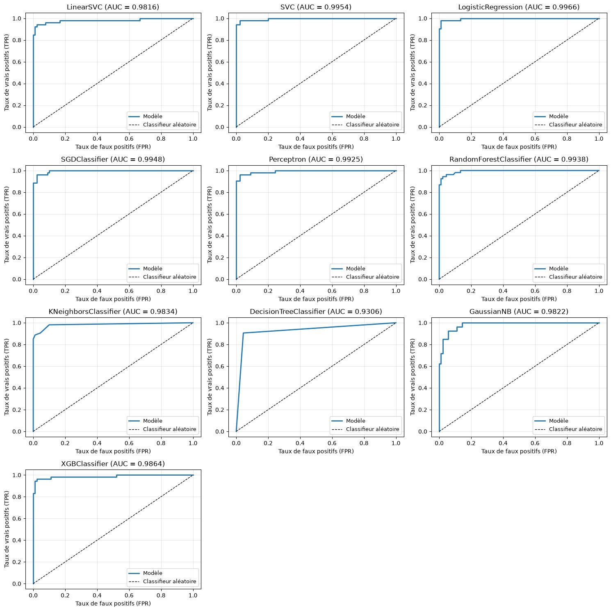
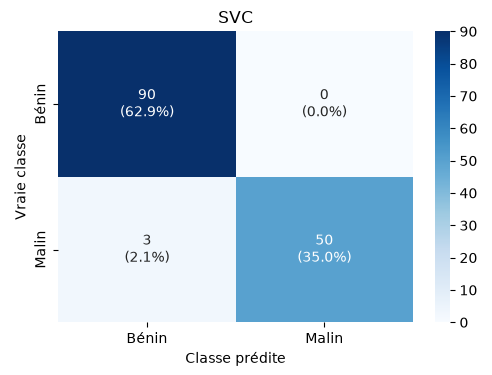
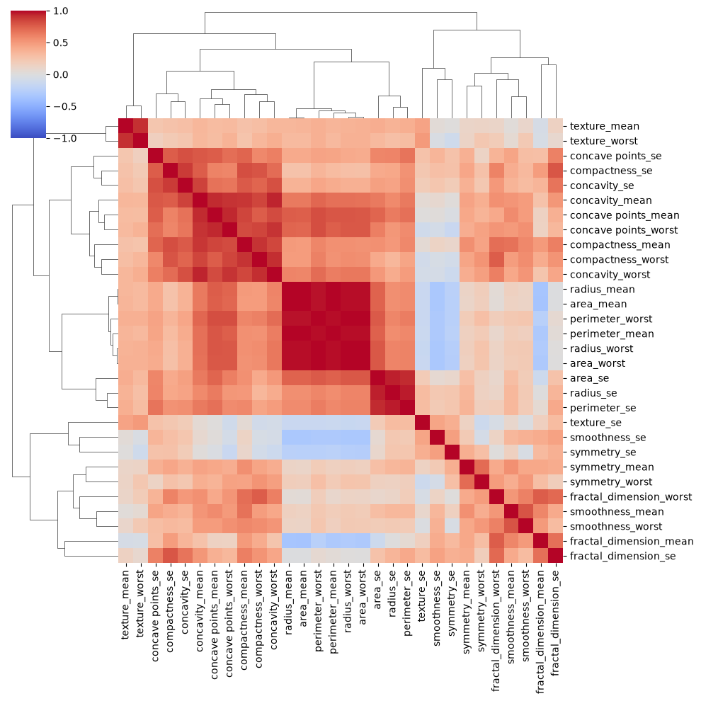
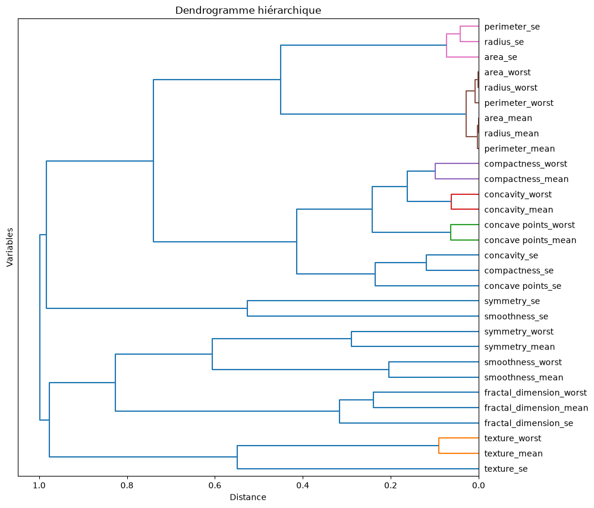
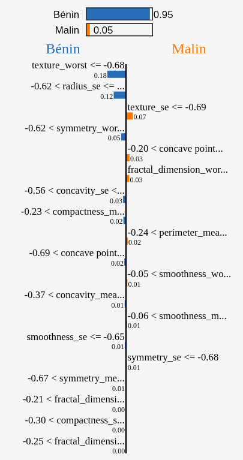

# Étude automatisée de cellules cancéreuses

## Introduction
Un travail de caractérisation de cellules issues de tumeurs du sein, pour déterminer automatiquement lesquelles sont bénignes et lesquelles sont malignes.

## Le problème
Comment distinguer de façon fiable une tumeur bénigne d'une tumeur maligne, à partir de mesures prises sur des cellules ? Ici, l'erreur la plus grave est ici le <i>faux négatif</i>. En effet, déclarer bénigne une tumeur qui est maligne peut coûter une vie.

## Le résultat
Le modèle retenu (SVC) classe correctement **97,9 %** des tumeurs du jeu de test, avec <i>3 faux négatifs sur 53 tumeurs malignes</i> et <i>aucun faux positif</i>.

## Étapes de la démarche

| Étape | Ce qui a été fait |
|---|---|
| [1. Préparation](1-nettoyage-et-pr%C3%A9paration.ipynb) | Suppression des colonnes inutiles, encodage du diagnostic, standardisation des 30 variables |
| [2. Sélection des variables](2-selection-des-variables.ipynb) | Regroupement des variables fortement corrélées, un représentant conservé par groupe : <i>19 variables retenues sur 30 au départ </i> |
| [3. Prédictions](3-pr%C3%A9dictions.ipynb) | Comparaison de 10 modèles sur un jeu de test |
| [4. Interprétation](4-interpr%C3%A9tation.ipynb) | Analyse des faux négatifs du modèle retenu avec LIME |

## Résultats

Tous les modèles dépassent une AUC de 0,95 : les modèles ont donc été départagés par leur nombre de faux négatifs. Le SVC en commet le moins, sans aucun faux positif.

Tableau comparatif des 10 modèles

| Modèle | Accuracy | AUC | Faux négatifs | Faux positifs |
|---|---|---|---|---|
| **SVC** | **97,9 %** | 0,995 | **3** | **0** |
| LogisticRegression | 96,5 % | **0,997** | 5 | 0 |
| XGBClassifier | 96,5 % | 0,986 | 4 | 1 |
| Perceptron | 95,8 % | 0,993 | 4 | 2 |
| RandomForestClassifier | 95,8 % | 0,994 | 5 | 1 |
| DecisionTreeClassifier | 95,8 % | 0,955 | 3 | 3 |
| LinearSVC | 95,1 % | 0,982 | 6 | 1 |
| KNeighborsClassifier | 95,1 % | 0,983 | 6 | 1 |
| SGDClassifier | 94,4 % | 0,985 | 6 | 2 |
| GaussianNB | 91,6 % | 0,982 | 7 | 5 |

*Jeu de test : 143 tumeurs (90 bénignes, 53 malignes). Les modèles sans graine aléatoire fixée peuvent varier légèrement d'une exécution à l'autre.*

Matrice de confusion du SVC

Sélection des variables : clustering des corrélations

Les variables dont la corrélation dépasse 0,9 sont regroupées. Dans chaque groupe, nous gardons la variable la plus corrélée aux autres membres, ou en cas d'égalité, la plus liée au diagnostic.

## Comprendre les erreurs

La méthode <i>LIME</i> a été utilisée pour expliquer les 3 faux négatifs du SVC :

- **2 cas limites** : le modèle leur attribue 38 % et 46 % de probabilité d'être malins. Un seuil de décision plus bas suffirait à les détecter.
- **1 cas atypique** : classé bénin avec une forte confiance (5 %). Sa texture faible et la faible variabilité de son rayon le font réellement ressembler à une cellule bénigne.

LIME du cas atypique

## Données et outils

- **Jeu de données** : [Breast Cancer Wisconsin (Diagnostic)](https://www.kaggle.com/datasets/uciml/breast-cancer-wisconsin-data), 569 tumeurs (357 bénignes, 212 malignes), décrites par 30 caractéristiques calculées sur des images numérisées de ponctions à l'aiguille fine.
- **Outils** : Python, pandas, scikit-learn, XGBoost, SciPy, seaborn, LIME.
